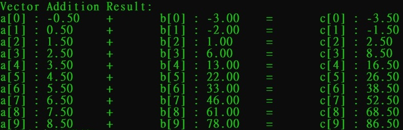

# CUDAVerify

If you had installed NVIDIA driver & CUDA toolkit on your computer, you can use this code to verify your CUDA environment if to be normal ! 

## Windows

Double click the *`windows_build.bat`* or open a terminal and go to *`windows_build.bat`* saved path and also input this command:

```
.\windows_build.bat
```

## Linux

Go to *`linux_build.sh`* saved path and also input this command:

```
./linux_build.sh
```

## Output

If you install completely and run the testing code and also you can see this result (output has same answer as your output.), congratulations ! Success for CUDA installation !  

<div align="center">
<br><br>
</div>